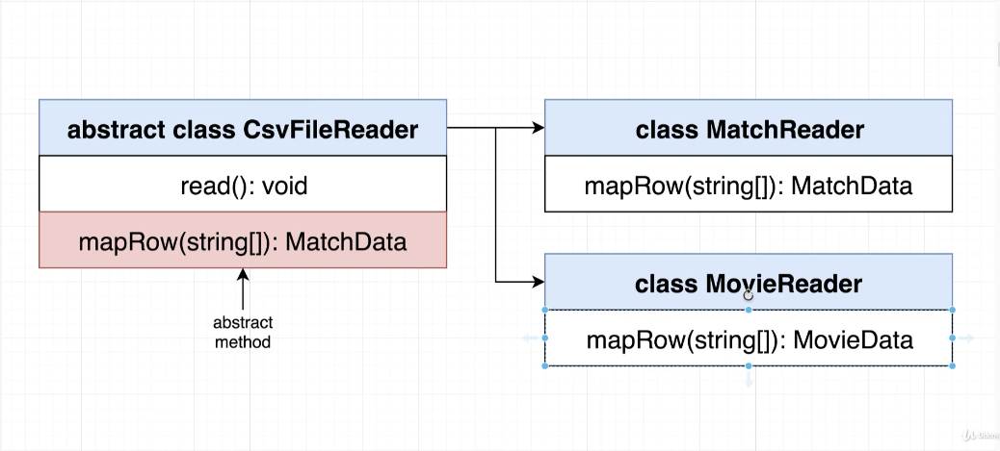
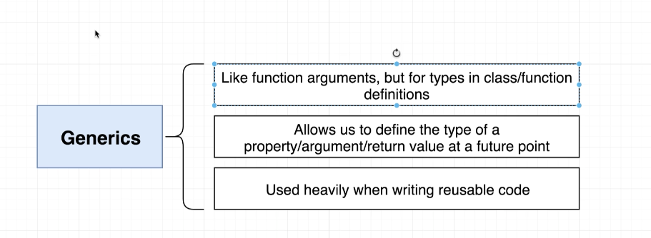
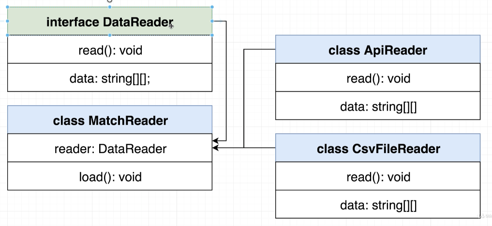
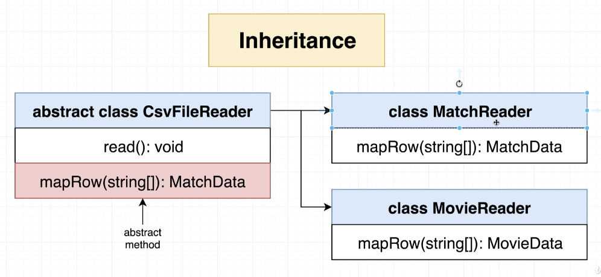
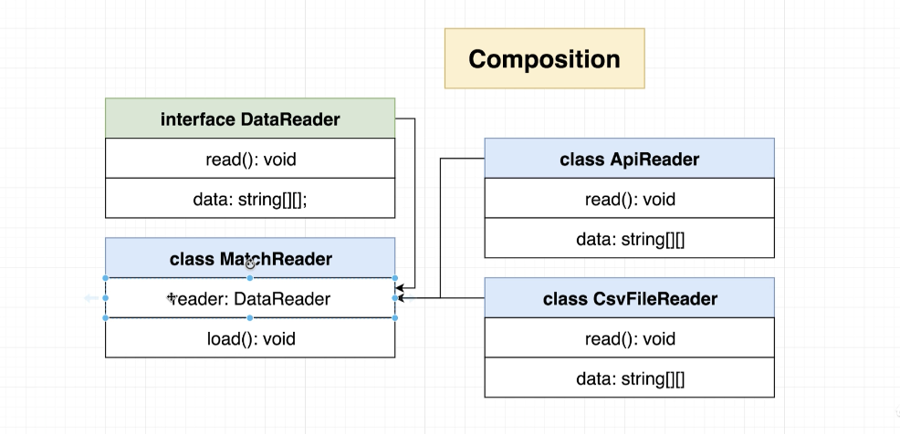

# Typescript: The Complete Developer's Guide [2020]

Udemy typescript 강의 정리 & project

강의 링크 : https://www.udemy.com/course/typescript-the-complete-developers-guide

---

## 섹션 1: Getting Started with Typescript

### The TS Type System

- Helps us catch erros during development
- Uses 'type annotations' to analyze our code
- Only active during development
- Doesn't provide any performance optimization

### 실행 순서

Typescript Code(Javascript with type annotations)

1. Typescript Compiler
2. Plain old Javascript
3. Browser executes plain Javascript, has no idea we wrote Typescript

### Summary

- Writing Typescript is the same as writing Javascript with some "extra documentation"
- Typescript has no effect on how our code gets executed by the browser or Node
- It is best to think of Typescript as being like a friend sitting behind you while you are coding.

### Get started

```
npm install -g typescript ts-node
```

```
tsc index.ts
-> index.js로 변환
node index.js
-> index.js 실행
```

```
ts-node index.ts
//javascript로 변환하고 한번에 실행
```

## 섹션 2: What is a Type System?

### Course Goal

1. Syntax + Features - Understand basic types in TS - Function typing + annotations - Type définition files - Arrays in TS - Modules systems
   \_ Classes + Refresher on OOP
2. Design Patterns - Projects

### Type

Easy way to refer to the different properties

- functions that a value has

value(우리가 변수에 지정할 수 있는 어떤 것 ex) string, number..)

예) "red"가 뭐야? 라고 물을 때 우리는
두가지 대답을 할 수 있다.
첫 번째는 string이다.
두 번째는 string이 가지는 properties와 method를 가진 value를 의미한다.

string은 concat(), charCodeAt(), indexOf() 등등 많은 property 와
메소드를 가지고 있다. 이렇게 다 설명하기는 불편하기 때문에
string이라고 한 단어로 요약해서 말하는 것이다.

Interface Todo는 Todo라는 새로운 type을 만들어 낸것
Response.data가 뭐냐고 물을 때 Todo라고 대답하는 것은
id, title, completed를 속성으로 갖는 Object라는 것을 요약해서 말하는것.
Id, title, completed는 Todo라는 type의 property다.

typescript는 모든 value가 type을 갖는다.

```
Type		Values That Have This Type
string		'hi there' ''
Number		.0025 -20
Boolean		true false
Date		new Date()
Todo		{id:1, completed:true, title:'trash'}
```

### Types

1. Primitive Types : - number, boolean, void, undefined - string, symbol, null
2. Object Types : - functions, arrays - classes, objects

### 왜 우리는 type에 대해 신경써야할까?

    - Types는 에러 코드를 분석하기 위한 typescript compiler에 의해 사용된다.
    - Types를 사용하면 다른 엔지니어가 코드베이스에 어떤 값이 흐르고 있는지 이해할 수 있다.

- 코드베이스: 특정 시스템, 애플리케이션, 컴포넌트 따위를 빌드할 때 사용되는 소스코드의 전체집합, 그것을 담은 저장소 -단일 저장소(ex: subversion)일수도 있고, 루트 커밋을 공유하는 여러 저장소(분산 cvs: ex) git)일수도 있음

* Where do we use types?
  -> everywhere!!

## 섹션 3: Type Annotations and Inference

1. Type annotations : 우리가 typescript에게 변수가 가리킬 value의 타입이 무엇인지 추가해주는 코드
   -> developers tell typescript the type
2. Type inference: typecript가 변수가 가리키는 value의 타입이 무엇인지 알아내려고 시도하는 것
   -> typescript guesses the type

### Understanding Inference

```
let apples = 5;
-> typescript가 변수의 type을 자동으로 알아낸다
let apples;
apples = 5;
-> typescript가 알아내지 못한다.(any)
```

Initialization(초기화)를 통해서만 inference가 가능하다.

### typescript가 알아서 type을 알아내는데 왜 annotation을 해줘야 하는 걸까?

JSON.parse('false') -> boolean
JSON.parse('4') -> number
JSON.parse('{"value":5}') -> {value:number}
JSON.parse('{"name":"alex"}') -> {name: string}

JSON.parse를 통해서 얻는 type은 값에 따라 다양하다. 따라서 typescript는 type을 예상할 수 가 없다. 이것을 ts는 any type으로 부르기로 한다(즉 any type의 의미는 ts가 어떤 타입의 값을 리턴 받을 지 모른다는 의미다)

-> 이것은 매우 안 좋은것. ts가 타입을 체크하지 못하면 오류를 잡아내지 못하기 때문에 의미가 없다.

따라서 몇몇의 경우는 annotation을 통해 typescript에게 type을 알려줘야한다

1. When a fucntion returns the 'any' type and we need to clarify the value

```
const json = '{"x":10, "y":20}';
const coordinates: { x: number; y: number } = JSON.parse(json);
console.log(coordinates); // {x:10, y:20}

//coordinates.dsfdsfsdfsdf -> error를 잡는다
// any type일때는 못잡음.
```

2. When we declare a variable on one line then initialize it later

```
let words = ['red', 'green', 'blue'];
let foundWord: boolean;

for(let i=0; i< words.length; i++){
  if(words[i] === 'blue'){
    foundWord = true;
  }
}
```

3. When we want a variable to have a type that cant't be inferred

```
let numbers = [-10, -1, 12];
let numberAboveZero: boolean | number = false;

for (let i = 0; i < numbers.length; i++) {
  if (numbers[i] > 0) {
    numberAboveZero = numbers[i];
  }
}

```

## 섹션 4. Annotations with functions and objects

1. 함수에 대한 type annotation -> 어떤 타입의 인자를 함수가 받을건지, 어떤 타입의 값을 함수가 리턴할 것 인지 typescript에게 말하기 위해 추가하는 코드

2. 함수에 대한 type inference -> typescript가 어떤 타입의 값을 함수가 리턴할 것인지 알아내려고 시도하는 것

-> 이 강의에서는 arguments, return value 모두 annotation을 한다.
return value는 ts가 자동으로 type infercne를 해주지만 annotation을 할 것 이다.

## 섹션 5. Mastering Typed Arrays

Typed Arrays : 일관된 type의 값이 element인 배열

### Why do we care?

- TS는 배열로부터 값을 추출할 때 type inference를 할 수 있다.

```
const cars = carMakers[0];
const myCar = carMakers.pop();
```

- TS는 type이 안 맞는 값들을 배열에 넣는 것을 방지해준다
- map, forEach, reduce같은 함수들의 도움을 받을 수 있다

```
carMakers.map((car: string) => {
return car;
})
```

- 유연함 - 배열들은 여전히 다양한 다른 타입들을 가질 포함할 수 있다.

```
const importantDates: (Date | string)[] = [new Date(), '2030-10-10'];
importantDates.push('dkfldkf');
importantDates.push(new Date());
```

### When to Use Typed Arrays

임의의 정렬 순서를 가진 레코드(기록)의 모음을 표현할때마다 필요하다!

## 섹션 6. Tuples in Typescript

Tuple: 각 요소가 한 레코드의 일부 속성을 나타내는 구조와 같은 배열

```
// annotation을 통해 순서를 바꿔서 입력할 수 없고 각 속성의 의미를 알게된다.
const tuple_pepsi: [string, boolean, number] = ['brown', true, 40];

// Type alias
type Drink = [string, boolean, number];
const coke: Drink = ['brown', true, 40];
const sprite: Drink = ['clear', true, 40];
const tea: Drink = ['brown', false, 0];
```

### Why Tuples?

// tuple이 object보다 한 눈에 알아보기 힘들다. 잘 사용하지 않음.

```
const carSpecs: [number, number] = [400, 3354];

const carStats = {
  horsePower: 400,
  weight: 3354
}
```

하지만 해당 기능은 ts의 공식 문서에 있는 ts 특징이고 나중에 실습할 때 다룰 예정.

## 섹션 7. The All-Important Interface

### Interface란?

object의 속성 이름과 value types를 묘사하는 새로운 type을 만들어 내는 것.

- 하나의 interface로 굉장히 다른 objects의 다른 속성들으 모형을 묘사할 수 있다.
- 이 매우 다른 objects이 다른 함수들과 상호작용하게 만들 수 있다.
  ex) printSummary

```
interface Reportable {
  //name: string;
  //year: Date;
  //broken: boolean;
  summary(): string;
}

const oldCivic = {
  name: "civic",
  year: new Date(),
  broken: true,
  summary(): string {
    return `name: ${this.name}`;
  }
};

const drink = {
  color: "brown",
  carbonated: true,
  sugar: 40,
  summary(): string {
    return `color: ${this.color}`;
  }
};

// summary property만 있어도 오류를 띄우지 않는다.
const printSummary = (item: Reportable): void => {
  console.log(item.summary());
};

printSummary(oldCivic);
printSummary(drink);

```

Interface Reportable
: Reportable is a gatekeeper to printSummary

oldCivic, drink
: Must satisfy the 'Reportable' interface to work with printSummary

## 섹션 8. Building functionality with Classes

- Instance Method Modifiers

* public : This method can be called any where, any time
* private: This method can only be called by other methods in this class
* protected: This method can be called by other methods in this class, or by other methos in child classes

- 부모 메소드를 오버라이딩 하는 경우 modifier 수정 불가능.

### Fields in classes

- constructor shortcut example

```
class Vehicle {
  constructor(public color: string)
}

// 위는 아래 처럼 풀어 쓸 수 있다.
class Vehicle {
  color: string;

  constructor(color: string){
    this.color = color;
  }
}
```

### Fields with Inheritance

- 상속을 받으면 child class는 constructor, methods 모두 자동으로 부모 클래스 것도 물려받게 된다.

```
// ParentClass or SuperClass
class Vehicle {
  constructor(public color: string) {}

  protected honk(): void {
    console.log("빵빵!");
  }
}

// Car: child cass
class Car extends Vehicle {
  //color에 public을 안 쓴 이유는 car의 color에 새로운 필드를 재할당 하거나 생성하고 싶지 않아서
  // color는 vehicle에 속한 property이기 때문. modifier를 안 붙이면 parameter, 붙이면 car의 property로 재할당된다.
  constructor(public wheels: number, color: string) {
    super(color);
  }

  private drive(): void {
    console.log("부르릉!");
  }
  startDrivingProcess(): void {
    this.drive();
    this.honk();
  }
}

const car = new Car(4, "pink");

```

## 섹션 9. Design Patterns with Typescript

get started

```
// Tool to help us run Typescript in the browser
npm install -g parcel-bundler
```

Parcel Bundler -> index.html - script of 'index.ts' -> compile it to JS then replace this script tag

src 폴더에 index.ts를 만들고 index.html에 넣어준뒤

```
parcel index.html
```


parcel bundler가 ts파일을 js파일로 변환시킨다.

### Map project structure

'src' Folder
index.ts - Map.ts - User.ts - Company.ts

파일명을 대문자 만드는 규칙
: 주 목적이 class를 export하는 것일 때 대문자를 사용한다.
index.ts(소문자로 시작하는 파일) :

- 주목적이 import
- anytime you have a file that either serves as something like the index.tx file
  so come in root of your application where a file that exports plain objects, plain functions or constants.

### Generating Random Data

위도, 경도 데이터를 random하게 만들어준다.

```
npm install faker;
```

### Type Definition Files

Typescript Code -> Type definition file -> JS Library

Type Definition을 가지고 있지 않으면 module import할 때 오류가 뜬다.
-> Could not find a declaration file for module 'faker'.
-> 수동적으로 type definition을 설치해줘야함.

Definitely Typed Naming Scheme
@types/{library name} -> @types/faker

대부분 type definition file이 존재한다.
to install that type definition file, we're going to reach into a project called 'definitely typed'
Definitely Typed: the name of the project that includes all these precreated or pregenerated type definition

npmjs.com 접속 -> @types/faker ->
Details쪽 보면
Files were epxorted from https://github.com/DefinitelyTypes/DefinitelyTypes/tree/master....
DefinitelyTypes-> Anytime you see that term they're talking about type definition files for javascript libraries.

```
npm install @types/faker
```

### Export Statements in Typescript

```
export const red = "red";
import { red } from "./User";

// default 방식
export default "red";
import red from "./User";
```

typescript world에서는 대개 default statement를 사용하지 않는다. {}여부가 헷갈리기 때문.
그러나 third party modules은 예외(import faker from 'faker';)

### Defining a Company

```
import faker from 'faker';

export class Company {
  companyName: string;
  catchPhrase: string;
  // location property를 초기화한게 아니다
  // location이 어떨지 typescript가 알려주는 것
  location: {
    lat: number;
    lng: number;
  };

  constructor() {
    this.companyName = faker.company.companyName();
    this.catchPhrase = faker.company.catchPhrase();
    // this.location.lat 방식으로 바로 값을 넣으려고 하면 error message를 받을 것이다.
    // location은 constructor내에서 undefined이기 때문
    this.location.lat = parseFloat(faker.address.latitude());
    this.location.lng = parseFloat(faker.address.longitude());
    /*
    this.location = {
      lat: parseFloat(faker.address.latitude()),
      lng: parseFloat(faker.address.latitude())
    };
    */
  }
}
```

다음과 같이 error message를 받는다.


### Google Maps Integration

```
npm install @types/googlemaps
```

This package contains type definitions for Google Maps JavaScript API -> ts파일에서 전역변수처럼 사용가능해짐.

### Why Use Private Modifiers? Here's Why

google map의 존재를 어떻게든지 다른 개발자들로부터 숨기는 것이 좋다.(모든 메소드를 CustomMap으로 wrap) -> 다른 개발자들이 프로젝트에 참여해서 구글맵 메소드를 건들면 앱이 깨질 수 있음.

```
export class CustomMap {
  private googleMap: google.maps.Map;

  constructor(divId: string){
    this.googleMap = new google.maps.Map(document.getElementById(divId), {
      zoom: 1,
      center: {
        lat: 0,
        lng: 0
      }
    })
  }
}
```

private modifier를 써서 googleMap에 접근하지 못하게 한다. (안써줄 경우 public이 default).

### One Possible Solution

```
addMarker(mappable: User | Company): void{
    new google.maps.Marker({
      map: this.googleMap,
      position: {
        lat: mappable.location.lat,
        lng: mappable.location.lng
      }
    })
  }
```

타입스크립트는 User, Company의 공통 속성(location)을 찾아서 참조할 수 있게 한다. 속성이름과 내용이 모두 같아야함.
그러나 이렇게 구성할 경우 method signature가 너무 커진다(mappable: User | Company | Park ...)

### Implicit Type Checks

```
// in CustomMap.ts
interface Mappable{
  location: {
    lat: number;
    lng: number;
  };
}


addMarker(mappable: Mappable): void{
    new google.maps.Marker({
      map: this.googleMap,
      position: {
        lat: mappable.location.lat,
        lng: mappable.location.lng
      }
    })
  }

```

Mappable 인터페이스 -> 어떤 클래스가 addMarker의 argument가 될 수 있는지에 대한 가이드라고 말 할 수 있다.

### Optional Implements Clauses

```
//in CustomMap.ts
export interface Mappable{
  location: {
    lat: number;
    lng: number;
  };
  markerContent(): string;
}

//in User.ts
export class Company implements Mappable{
  ...
}
```

implements 절을 통해서 인터페이스를 구현하면서 타입스크립트가 클래스를 추가적으로 체크해준다.

## 섹션 10: More on Design Patterns

### Configuring the TS Compiler

- typescript compiler 환경설정법

```
tsc --init
```

- tsconfig.json파일이 생성됨.
- outDir : "./build" -> 컴파일된 js파일이 저장되는 곳
- rootDir : "./src" -> 컴파일할 ts 파일 두는 곳
- tsc로 실행해보면 build로 잘 컴파일되는 것을 알 수 있다.

```
tsc -w
```

ts파일 변경할 때 마다 자동으로 컴파일해준다.

## Concurrent Compilation and Execution

- automate the process of running every single time we make change.

```
npm init -y
npm install nodemon concurrently
```

- package.json

```
"scripts": {
    "start:build": "tsc -w",
    "start:run": "nodemon build/index.js",
    "start": "concurrently npm:start:*"
  }
```

### Type Guards

- type card is going to be a check on the type of this.collection

```
if(this.collection instanceof Array){
 ...
}
```

우리는 우리가 내부에서 다루고 있는 특정 유현 중 하나(number[] or string)에 대한 접근을 되찾기 위해 type guard를 사용할 수 있다.

instanceof 연산자는 생성자의 prototype 속성이 객체의 프로토타입 체인 어딘가 존재하는지 판별합니다.

- primitive type(원시 자료형)

* typeof : Narrow type of a value to a primitive type -> 값의 좁은 타입(원시 자료형)
  - number, string, boolean, symbol
* instanceof: Narrow down every other type of value -> 타입의 축소

  - Every other value that is created with a constructor function

### Completed Linked List Code

```
// LinkedList.ts
class Node{
next: Node | null = null; //default: null

constructor(public data: number){}
}

export class LinkedList{
head: Node | null = null;

add(data: number): void {
  const node = new Node(data);

  if(!this.head){
    this.head = node;
    return;
  }

  let tail = this.head;
  while(tail.next){
    tail = tail.next;
  }

  tail.next = node;
}

get length(): number {
  if(!this.head){
    return 0;
  }

  let length = 1;
  let node = this.head;
  while(node.next){
    length ++;
    node = node.next;
  }

  return length;
}

at(index: number) :Node{
  if(!this.head){ // 데이터가 없을 때
    throw new Error('Index out of bounds');
  }

  let counter = 0;
  let node: Node | null = this.head;
  while(node){
    if(counter === index){
      return node;
    }

    counter ++;
    node = node.next;
  }

  throw new Error('Index out of bounds');
}

compare(leftIndex: number, rightIndex: number): boolean{
  if(!this.head){
    throw new Error('List is empty');
  }

  return this.at(leftIndex).data > this.at(rightIndex).data;
}

swap(leftIndex:number, rightIndex: number): void{
  const leftNode = this.at(leftIndex);
  const rightNode = this.at(rightIndex);

  const leftHand = leftNode.data;
  leftNode.data = rightNode.data;
  rightNode.data = leftHand;
}

print(): void{
  if(!this.head){
    return;
  }

  let node: Node | null = this.head;
  while(node){
    console.log(node.data);
    node = node.next;
  }
}
}
```

### Just...One...More...Fix...

LinkedList sorting 코드

```
const linkedList = new LinkedList();
linkedList.add(500);
linkedList.add(10);
linkedList.add(-10);
linkedList.add(-2);
linkedList.add(3);

const sorter = new Sorter(linkedList);
sorter.sort();
linkedList.print();

```

-> 매번 Sorter 인스턴스를 만들어서 sorting하는 것 보다 해당 collection 클래스에서 sort 메소드를 호출하는것이 더 낫지 않을까?

ex) new NumberCollection([72, -1, 29, 7]).sort();

### Abstract with Inheritance

Abstract Classes

- Can't be used to create an object directly.
- Only used as a parent class
- Can contain real implementation for some methods
- The implemented methods can refer to other methods that don't actually exist yet(we still have to provice names and types for the un-implemented methods).
- Can make child classes promise to implement some other method.

Abstract Class로 Refactoring

Sorter.ts

```
export abstract class Sorter {
  // customize할 메소드 구현체
  abstract compare(leftIndex:number, rightIndex:number): boolean;
  abstract swap(leftIndex: number, rightIndex:number): void;
  abstract length: number;

  sort(): void{
    const { length } = this;

    for(let i = 0; i < length; i++){
      for(let j = 0; j < length - i - 1; j++){
        if(this.compare(j, j+1)){
          this.swap(j, j+1);
        }
      }
    }
  }
}
```

NumbersCollection.ts

```
import { Sorter } from './Sorter';

export class NumbersCollection extends Sorter{
  constructor( public data: number[]) {
    super();
  }

  get length(): number{
    return this.data.length;
  }

  compare(leftIndex: number, rightIndex: number): boolean {
    return this.data[leftIndex] > this.data[rightIndex];
  }

  swap(leftIndex: number, rightIndex: number): void{
    const leftHand = this.data[leftIndex];
    this.data[leftIndex] = this.data[rightIndex];
    this.data[rightIndex] = leftHand;
  }
}
```

CharactersCollection.ts

```
import { Sorter } from './Sorter';

export class CharacterCollection extends Sorter{
  constructor(public data: string){
    super();
  }

  get length(): number{
    return this.data.length;
  }

  compare(leftIndex: number, rightIndex: number): boolean{
    return this.data[leftIndex].toLowerCase() > this.data[rightIndex].toLowerCase();
  }

  swap(leftIndex:number, rightIndex: number): void{
    const characters = this.data.split('');

    const leftHand = characters[leftIndex];
    characters[leftIndex] = characters[rightIndex];
    characters[rightIndex] = leftHand;

    this.data = characters.join().replace(/,/gi,"");
  }
}
```

LinkedList.ts

```
import { Sorter } from './Sorter';

class Node{
  next: Node | null = null; //default: null

  constructor(public data: number){}
}

export class LinkedList extends Sorter{
  head: Node | null = null;

  add(data: number): void {
    const node = new Node(data);

    if(!this.head){
      this.head = node;
      return;
    }

    let tail = this.head;
    while(tail.next){
      tail = tail.next;
    }

    tail.next = node;
  }

  get length(): number {
    if(!this.head){
      return 0;
    }

    let length = 1;
    let node = this.head;
    while(node.next){
      length ++;
      node = node.next;
    }

    return length;
  }

  at(index: number) :Node{
    if(!this.head){ // 데이터가 없을 때
      throw new Error('Index out of bounds');
    }

    let counter = 0;
    let node: Node | null = this.head;
    while(node){
      if(counter === index){
        return node;
      }

      counter ++;
      node = node.next;
    }

    throw new Error('Index out of bounds');
  }

  compare(leftIndex: number, rightIndex: number): boolean{
    if(!this.head){
      throw new Error('List is empty');
    }

    return this.at(leftIndex).data > this.at(rightIndex).data;
  }

  swap(leftIndex:number, rightIndex: number): void{
    const leftNode = this.at(leftIndex);
    const rightNode = this.at(rightIndex);

    const leftHand = leftNode.data;
    leftNode.data = rightNode.data;
    rightNode.data = leftHand;
  }

  print(): void{
    if(!this.head){
      return;
    }

    let node: Node | null = this.head;
    while(node){
      console.log(node.data);
      node = node.next;
    }
  }
}
```

### Interfaces vs Abstract Classes

Interfaces

- 서로 다른 클래스 간에 계약 설정.
  -> Sortable 인터페이스를 통해 charactersCollection, NumbersCollection 객체가 Sorter에서 sort할 수 있게 했었다.
- 우리가 함께 사용하길 원하는 매우 다른 객체들을 가졌을 때 사용
- 느슨한 결합을 촉진하다
- 직접적인 의존성 없이 다른 클래스들을 함께 사용할 수 있게 한다.

Inheritance / Abstract Classes

- 서로 다른 클래스 간에 계약 설정.
- 우리가 객체의 정의를 세우려고 할때 사용
- 강하게 클래스들을 결합시킨다.

## 섹션11. Reusable Code

CSV Data -> Load -> Parse -> Analyze -> Report

### Type Definition Files - Again!

다른 javascript Libaray처럼 nodejs standard library(fs, http, os)를 사용할때는 nodejs type definition file을 설치해야한다.

```
npm install @types/node
```

### Reading CSV Files

Load and Parse 단계

코드

```
import fs from 'fs';

const matches = fs.readFileSync("football.csv", {
  encoding: 'utf-8'
}).split('\n')
.map((row: string): string[] => {
  return row.split(',');
});

console.log(matches);

```

결과

```
[
  [ '27/10/2018', 'Watford', 'Huddersfield', '3', '0', 'H', 'M Dean' ],
[start:run]   [ '28/10/2018', 'Burnley', 'Chelsea', '0', '4', 'A', 'C Pawson' ],
... 225 more items
]
```

### Using Enums

```
enum MatchResult {
  HomeWin ='H',
  AwayWin ='A',
  Draw = 'D'
};
```

### When to Use Enums

Enum이란?

> 컴퓨터 프로그래밍에서 Enumerated Type(열거형 타입)을 줄여서 보통 Enum이라고 쓴다. 요소, 멤버라 불리는 명명된 값의 집합을 이루는 자료형이다. 열거자 이름들은 일반적으로 해당 언어의 상수 역할을 하는 식별자이다. - wikipeida -

언제 Enum을 사용하면 좋은가?

> 보통 도메인을 설계할 때 사용하는 인스턴스의 수가 정해져 있고 관련된어 처리할 수 있는 상수값이 여러개 존재할 때 Enum을 사용한다.

TypeScript enum을 사용하지 않는 게 좋은 이유를 Tree-shaking 관점에서 소개합니다.
https://engineering.linecorp.com/ko/blog/typescript-enum-tree-shaking/

Tree-shaking시에 typescript 컴파일러는 IIFE(즉시 실행 함수)를 포함한 코드를 생성하기 때문에 Tree-shaking이 되지 않는다. Union Types > const enum을 추천

```
// Union Types(Union 타입은 여러 타입 중 하나 일 수 있는 값)
const MatchResult = {
  HomeWin: 'H',
  AwayWin: 'A',
  Draw: 'D'
} as const;

type MatchResult = typeof MatchResult[keyof typeof MatchResult];
```

```
// const enum
const enum MatchResult {
  HomeWin = 'H',
  AwayWin = 'A',
  Draw = 'D'
}
```

-> Babel로 트랜스파일할 수 없다는 단점이 있다.

### Type Assertions

```
 row[5] as MatchResult
```

type assertion : where you and i as the developers are trying to override type scripts default behavior or kind of tell typescript that we know what is going on here.

### Describing a Row with a Tuple

```
// tuple
type MatchData = [Date, string, string, number, number, MatchResult, string];

class CsvFileReader{
  data: MatchData[] = [];
  ...
}
```

### Understanding Refactor #1



### Variable Types with Generics



any를 이용하여 구현하면 저장하고 있는 자료의 타입이 모두 같지 않다는 문제점이 생긴다.

제네릭은 어떠한 클래스 혹은 함수에서 사용할 타입을 그 함수나 클래스를 사용할 때 결정하는 프로그래밍 기법을 말한다.

### Interface-Based Approach



### Inheritance vs Composition




- Inheritance: Characterized by an 'is a' relationship between two classes.
  ex) MatchReader is a CsvFileReader -> MatchReader는 CsvFileReader에 속해있는 모든 다른 메소드와 속성을 갖고 있기 때문이다.
- Composition: Characterized by a 'has a' relationship between two classes.
  -> MatchReader는 csvFileReader같은 외부 객체의 참조를 가졌다.

상속보다 컴포지션을 더 선호해야한다.
컴포지션은 한 클래스가 다른 클래스에서 상속하는 대신 다른 클래스를 포함하는 클래스 간의 관계 유형이다.
더 유연하고 느슨하게 결합된 애플리케이션을 설계할 수 있이 때문에 상속보다 선호되어야한다.

참고 url :https://www.koderhq.com/tutorial/typescript/composition/

#### 상속 vs 구성 : 장단점

상속이 나쁘다는 의미는 아닙니다. 개발자는 여전히 상속을 사용해야합니다.

구성은 상속을 사용하기 전에 고려해야 할 대안 일뿐입니다.

- 상속 장점 : 재사용 가능한 코드, 이해하기 쉬움
- 상속 단점 : 밀접하게 결합되고 취약하며 남용 될 수 있음

- 구성 장점 : 재사용 가능한 코드, 유연성, 느슨하게 결합 됨
- 구성 단점 : 이해하기 어렵습니다.

#### Summary : 기억해야 할 사항

- 컴포지션은 상속하는 대신 다른 클래스 내부의 클래스를 인스턴스화하고 액세스합니다.
- 모든 상속 관계를 구성으로 변환 할 수 있습니다.
- 다른 클래스 내부에 설치되어있는 클래스는 호출 객체를 참조하기 위해 this 키워드를 가져야합니다.
- 내부 개체에 대한 액세스는 여러 수준의 점 표기법을 통해 수행됩니다.
- 우리는 일반적으로 상속보다 구성을 선호해야합니다.

### Goal Moving Forward

남은 issue

```
// in index.ts
let manUnitedWins = 0;

for(let match of matchReader.matches) {
  if(match[1] === 'Man United' && match[5] === MatchResult.HomeWin){
    manUnitedWins ++;
  }else if(match[2] === 'Man United' && match[5] === MatchResult.AwayWin){
    manUnitedWins ++;
  }
}

console.log(`Man United won ${manUnitedWins} games`);
```

- 특정 팀의 이름을 딴 변수
  -> manUnitedWins
- 분석 유형이 고정되어 있다
  -> match[1] === 'Man United'
- 다른 format으로 결과를 보고할 수 없다
  -> console.log(`Man United won ${manUnitedWins} games`);

[refactor_diagram](./img/sh05.png)

### static method로 변경

```
// in Summary.ts
export class Summary{
  static winsAnalysisWithHtmlReport(team: string): Summary{
    return new Summary(
      new WinsAnalysis(team),
      new HtmlReport()
    )
  }
  constructor(public analyzer: Analyzer, public outputTarget: OuputTarget){}

  buildAndPrintReport(matches: MatchData[]): void{
    const output = this.analyzer.run(matches);
    this.outputTarget.print(output);
  }
}

// in MatchReader.ts
export class MatchReader {
  static fromCsv(filename: string): MatchReader{
    return new MatchReader(new CsvFileReader(filename));
  }

  matches: MatchData[] = [];

  constructor(public reader: DataReader) {}

  load(): void{
    this.reader.read();
    this.matches = this.reader.data.map((row: string[]) :MatchData=> {
      return [
        dateStringToDate(row[0]),
        row[1],
        row[2],
        parseInt(row[3]),
        parseInt(row[4]),
        row[5] as MatchResult,
        row[6]
      ];
    });
  }
}
```

index.ts

```
import { MatchReader } from './MatchReader';
import { Summary } from './Summary';

//staic method로 접근
const matchReader = MatchReader.fromCsv('football.csv')
matchReader.load();

const summary = Summary.winsAnalysisWithHtmlReport('Man United');
summary.buildAndPrintReport(matchReader.matches);
```

### Type Inference with Generics

```
class ArrayOfAnyting<T> {
  constructor(public collection: T[]){}

  get(index: number): T {
    return this.collection[index];
  }
}

const arr = new ArrayOfAnyting(['a','b']);
```

<string>을 적어주지 않아도 오류가 나지 않는다. -> type을 알아서 체크 = Type Inference

### Function Generics

```
function printAnything<T>(arr: T[]): void{
  for(let i = 0; i < arr.length; i++){
    console.log(arr[i]);
  }
}

printAnything(['a', 'b', 'c']);
```

printAnything(['a', 'b', 'c'])에서 에러가 나지 않지만 generic에 type annotation을 추가하는 것을 추천한다. -> 에러 잡는데 도움을 주기 때문

printAnything<string>(['a', 'b', 'c']);

### Generic Constraints

```

class Car {
  print() {
    console.log('I am a car');
  }
}

class House {
  print() {
    console.log('I am a house');
  }
}

interface Printable {
  print(): void;
}

function printHousesOrCars<T extends Printable>(arr: T[]): void{
  for(let i=0; i< arr.length; i++){
    arr[i].print();
  }
}

printHousesOrCars<Car>([new Car(),new Car()]);
printHousesOrCars<House>([new House(), new House()]);
```

<T extends Printable>을 통해 제네릭 타입이 print메소드를 포함할 것임을 알려준다.

## Let's build a Web Framework

### Parcel Setup

```
npm install -g parcel-bundler
```

### Adding JSON Server

설치방법

```
npm install -g json-server
```

실행방법

```
json-server -w db.json
```

### Composition with Nested Objects

Nested objects are the objects that are inside an another object

```
// in User.ts
export class User {
  public events: Eventing = new Eventing();
...
}
```

```
// in index.ts
user.events.on('change', () => {
  console.log('change!');
});

user.events.trigger('change');
```

### Refactoring Sync

[sync_diagram](./img/sh06.png)

### Optional Properties

```
tsc --init
```

tsconfig.json 파일을 만들어주면 Strict Type-Checking Option이 true로 설정된다.

```
import axios, { AxiosPromise } from 'axios';

interface HasId {
  id?: number;
}

export class Sync<T extends HasId> {
  constructor(public rootUrl: string){}

  fetch(id: number): AxiosPromise {
    return axios.get(`${this.rootUrl}/${id}`);
  }

  save(data: T): AxiosPromise {
    const { id }  =  data;

    if(id){
      //put -> update
      return axios.put(`${this.rootUrl}/${id}`, data);
    }else{
      //post
      return axios.post(this.rootUrl, data);
    }
  }
}
```

tsconfig.json 파일 생성 전에 id에 마우스를 hover하면 number type만 표시되었는데,

설정 파일 생성 후 number | undefined로 표시된다. -> optional property를 사용할 경우 strict mode로 진행하는 것이 좋다.
(하지만 현재는 중요하지 않은 error를 띄우므로 개발 완료뒤 에러 처리)

### Two Important Rules

1. In Typescript, strings can be types.
2. In JS(and therefore TS), all object keys are strings

=> The keys of an object can actually be a type as well.

### An Advanced Generic Constraint

```
export class Attributes<T> {
  constructor(private data: T) {}

  get<K extends keyof T>(key: K): T[K]  {
    return this.data[key];
  }

  set(update: T): void {
    Object.assign(this.data, update)=
  }
}
```

```
interface UserProps {
  id?: number;
  name?: string;
  age?: number;
}
```

T가 UserProps라면 K는 T의 Key만 가능하다. -> id, name, age

각 key값에 맞는 type return을 가능하게 한다. (T[k] = UserProp[id]..)

### Composition is Delegation

[Caller_diagram](./img/sh07.png)
현재 기능들을 User클래스에서 Sync, Attributes등으로 분리해놓은 상태이므로 각 기능을 호출하려면,

user.sync.save(), user.attributes.get('id') 방식으로 호출해야한다.

이것은 번거롭고 복잡하므로 바로 호출할 수 있도록 구조를 변경해본다.

### Reminder on Accessors

get Accessors 사용법

```
// A quick reminder on accessors

class Person {
  constructor(public firstName: string, public lastName: string){}

  get fullName(): string {
    return `${this.firstName} ${this.lastName}`;
  }
}

const person = new Person('firstname', 'lastname');
console.log(person.fullName);

```

결과

```
firstname lastname
```

### Passthrough Methods

```
export class User {
  ...
  get on() {
    return this.events.on;
  }

  get trigger() {
    return this.events.trigger;
  }

  get get() {
    return this.attributes.get;
  }
}
```

```
const user = new User({ name: "new record", age: 11});
user.on('change', () => {});
```

여기서 this가 User로 잡고 있기 때문에 events undefined error가 뜨는데 arrow function으로 해결하면 된다.(Context Issue)

```
export class Eventing {
  events: { [key: string]: Callback[] } = {};

  on = (eventName: string, callback: Callback): void  => {
    const handlers = this.events[eventName] || [];
    handlers.push(callback);
    this.events[eventName] = handlers;
  }

  trigger = (eventName: string): void => {
    const handlers = this.events[eventName];

    if(!handlers || handlers.length === 0){
      return;
    }

    handlers.forEach(callback => {
      callback();
    });
  }
}
```

### Final User Refactor

```
//in Model.ts
import { AxiosPromise, AxiosResponse } from "axios";
import { ApiSync } from "./ApiSync";
import { Eventing } from "./Eventing";

interface ModelAttributes<T> {
  set(value: T): void;
  getAll(): T;
  get<K extends keyof T>(key: K): T[K];
}

interface Sync<T> {
  fetch(id: number): AxiosPromise;
  save(data: T): AxiosPromise;
}

interface Events {
  on(eventName: string, callback: () => void): void;
  trigger(eventName: string): void;
}

interface HasId{
  id?: number;
}

export class Model<T extends HasId> {
  constructor(
    private attributes: ModelAttributes<T>,
    private events: Eventing,
    private sync: ApiSync<T>
    ){}

    get on() {
      return this.events.on;
    }

    get trigger() {
      return this.events.trigger;
    }

    get get() {
      return this.attributes.get;
    }

    set(update: T): void {
      this.attributes.set(update);
      this.events.trigger('change');
    }

    fetch(): void{
      const id = this.get('id');

      if(typeof id !== 'number'){
        throw new Error('Cannot fetch without an id');
      }

      this.sync.fetch(id).then((response: AxiosResponse):void => {
        this.set(response.data);
      });
    }

    save(): void{
      this.sync.save(this.attributes.getAll())
      .then((response: AxiosResponse): void => {
        this.trigger('save');
      })
      .catch(() => {
        this.trigger('error');
      })
    }
}
```

```
in User.ts
import { Model } from './Model';
import { Attributes } from './Attributes';
import { ApiSync } from './ApiSync';
import { Eventing } from './Eventing';

export interface UserProps {
  id?: number;
  name?: string;
  age?: number;
}

const rootUrl = "http://localhost:3000/users";

export class User extends Model<UserProps>{
  static buildUser(attrs: UserProps): User{
    return new User(
      new Attributes<UserProps>(attrs),
      new Eventing(),
      new ApiSync<UserProps>(rootUrl)
    );
  }
}
```

### Model Wrapup

```
// in index.ts
import { User } from './models/User';

const user = User.buildUser({
  id: 1
});

user.on('change', () => {
  console.log(user);
});

user.fetch();
```

### Shortened Passthrough Methods

```
class Model<T extends HasId>{
   constructor(
    private attributes: ModelAttributes<T>,
    private events: Eventing,
    private sync: ApiSync<T>
    ){}

    on = this.events.on;
    trigger = this.events.trigger;
    get = this.attributes.get;

    ...
}
```

constructor shorten syntax를 사용하지 않으면 constructor 내부에 초기화한 필드나 메소드는 javascript로 컴파일할 경우 나중에 선언되기 때문에 오류가 날 수 있다.

초기화하는 경우는 shorten syntax를 사용하도록 하자.

### Adding Methods to the User

- DocumentFragment

* DocumentFragment 노드를 생성해서 사용하면 라이브 DOM 트리 외부에 경량화된 문서 DOM을 만들 수 있다.
* DocumentFragment는 마치 라이브 DOM 트리처럼 작동하되, 메모리상에서만 존재하는 빈 문서 템플릿으로 생각하면 된다.

### Reusable View Logic

[UserForm_composition](./img/sh08.png)

bidirectional relationship -> usually generally a sign that maybe composition is not the best idea or at least the division of methods that we have between the two is not the best idea.

-> composition is not the best solution here

Inheritance is pretty straightforward solution here.

[UserForm_inheritance](./img/sh09.png)

### Extracting a View Class

in View.ts

```
import { User } from '../models/User';

export abstract class View {
  constructor(public parent: Element, public model: User){
    this.bindModel();
  }

  abstract eventsMap(): { [key: string]: () => void };
  abstract template(): string;

  bindModel(): void{
    this.model.on('change', () => {
      this.render();
    });
  }

  bindEvents(fragment: DocumentFragment): void{
    const eventsMap = this.eventsMap();

    for (let eventKey in eventsMap){
      const [eventName, selector] = eventKey.split(':');

      fragment.querySelectorAll(selector).forEach(el => {
        el.addEventListener(eventName, eventsMap[eventKey]);
      });
    }
  }

  render(): void{
    this.parent.innerHTML = '';

    const templateElement = document.createElement('template');
    templateElement.innerHTML = this.template();

    this.bindEvents(templateElement.content);

    this.parent.append(templateElement.content);
  }
}
```

in UserForm.ts

```
import { View } from "./View";

export class UserForm extends View{
  eventsMap(): { [key: string]: () => void } {
    return {
      'click:.set-age': this.onSetAgeClick,
      'click:.change-name': this.onSetNameClick
    };
  }

  onSetAgeClick = (): void => {
    this.model.setRandomAge();
  }

  onSetNameClick = (): void => {
    const input = this.parent.querySelector('input');

    if(input){
      const name = input.value;

      this.model.set({ name });
    }
  }

  template(): string {
    return `
    <div class="form">
      <h1>User Form</h1>
      <p>User name: ${this.model.get('name')}</p>
      <p>User age: ${this.model.get('age')}</p>
      <input type="text" />
      <button class="change-name">Change Name</button>
      <button class="set-age">Set Random Age</button>
    </div>
    `
  }
}
```

### Extending with Generic Constraints

View class는 결국 Model의 한 property만 필요하게 되는 것이 아니라 대부분을 필요로 하게 된다. 따라서 새로운 인터페이스를 만들어서 복붙하는 것보단 Model 클래스를 그대로 상속받는 것이 나은데, 이때 Model 클래스도 class Model<T extends HasId> 와 같이 제네릭으로 구현되어있다. 이러한 경우에는 다음과 같이 구현한다.

in View.ts

```
export abstract class View<T extends Model<K>, K> {
  ...
}
```

in UserForm.ts

```
export class UserForm extends View<User, UserProps>{
  ...
}
```

### <template>: 콘텐츠 템플릿 요소

- HTML <template> 요소는 페이지를 불러온 순간 즉시 그려지지는 않지만, 이후 JavaScript를 사용해 인스턴스를 생성할 수 있는 HTML 코드를 담을 방법을 제공
- 템플릿은 콘텐츠 조각을 나중에 사용하기 위해 담아놓는 컨테이너로 생각하세요. 페이지를 불러오는 동안 구문 분석기가 <template> 요소의 콘텐츠도 읽기는 하지만, 이는 유효성을 검증하기 위함이며 렌더링 하기 위함은 아닙니다.
- 다만, HTMLTemplateElement는 읽기 전용 content 속성을 가집니다. content는 템플릿이 담고 있는 DOM 하위 트리를 나타내는 DocumentFragment입니다.

#### Javascript 성능개선 참고 - Document​Fragment

- reflow: 어떠한 액션이나 이벤트에 의해 DOM 요소의 크기나 위치등을 변경하면 해당 노드의 하위 노드와 상위의 노드들을 포함하여 Layout 단계(브라우저의 Viewport내에서 생성된 Render Tree의 각각의 노드들의 위치와 크기를 계산, 즉 생상된 Render Tree 노드들이 가지고 있는 스타일과 속성에 따라서 브라우저 화면의 어느 위치에 어느 크기로 출력될지 계산하는 단계)를 다시 수행하게 된다. 즉, 변경하려는 특정 요소의 위치와 크기뿐만 아니라 연관된 요소들의 위치와 크기도 재계산을 하기 때문에 브라우저의 퍼포먼스를 저하시키는 요인이다.

reflow를 줄이기 위한 개선방법으로 DocumentFragment를 활용한다. DocumentFragment는 부모가 없는 아주 작은 document객체를 나타낸다. 노드로 구성된 문서 구조의 일부를 저장한다.

중요한 차이점은 활성화된 문서 트리 구조의 일부가 아니기 때문에 fragment를 변경해도 문서에는 영향을 미치지 않으며 성능에도 영향이 없다

사용법

- DocumentFragment를 생성하고, 그 안에서 DOM 하위 트리를 조립한 다음, appendChild()나 insertBefore()와 같은 Node 인터페이스 메서드를 사용하여 DOM에 삽입
- 이렇게 하면 DocumentFragment의 노드들이 DOM으로 이동되고 빈 DocumentFragment만 남게 됩니다. 모든 노드가 한 번에 문서에 삽입되기 때문에 노드를 개별로 하나씩 삽입할 때마다 리플로우와 렌더링을 해주는 대신 단 한 번의 리플로우와 렌더링만 발생
- <template> 요소는 HTMLTemplateElement.content 속성에 DocumentFragment를 포함하고 있습니다.

#### 브라우저 성능 개선

Repaint와 Reflow를 발생시키는 원인

- 브라우저 창 크기 변화
- 폰트 크기의 변화
- 스크롤 하는 경우
- 클래스 속성 조작

* Reflow를 최소화 하는 방법

- DOM Tree의 Depth를 최소화한다
- javascript를 통해 스타일 변화를 주어야 할 경우, 가급적 한 번에 처리
  ```
  e.target.style.width = "150px"; // reflow 발생
  e.target.style.height = "300px"; // reflow 발생
  ```
  다음과 같이 변경
  ```
  e.target.style = 'width: 150px; height: 300px';
  ```
- CSS 하위 선택자는 필요한 만큼만 정리하는 것이 비용이 절감됨.
- 애니메이션이 있는 요소는 position: absolute 또는 position: fixed로 지정하는 것이 좋다.
  애니메이션은 요소의 크기 또는 위치가 변경되는 것을 의미하는데, 요소가 변경될 때 마다 주위 요소들은 영향을 받게 위치나 크기가 변경될 수 있다. 따라서 reflow가 발생되고 변경된 요소에 의한 나머지 요소들도 다시 위치를 재계산하게 되어 결국 시간이 늘어나게됨.
  애니메이션이 들어간 요소의 display 속성을 position: absolute나 fixed로 지정하여 다른 요소에 영향이 없도록 하는것이 reflow 단계에서 연산시간이 줄어들 수 있다.

출처: https://oyg0420.tistory.com/entry/%EB%B8%8C%EB%9D%BC%EC%9A%B0%EC%A0%80%EC%9D%98-Reflow-%EC%99%80-Repaint#c -> 브라우저 원리 잘 설명되어있음 참고.

### CollectionView Implementation

[collectionView](./img/sh10.png)

in Collection.ts

```
import axios, { AxiosResponse } from 'axios';
import { Eventing } from "./Eventing";

export class Collection<T, K> {
  models: T[] = [];
  events: Eventing = new Eventing();

  constructor(
    public rootUrl: string,
    public deserialize: (json: K) => T
    ) {}

  get on(){
    return this.events.on;
  }

  get trigger(){
    return this.events.trigger;
  }

  fetch(): void{
    axios.get(this.rootUrl)
      .then((response: AxiosResponse) => {
        response.data.forEach((value: K) => {
          this.models.push(this.deserialize(value));
        });
        this.trigger('change');
      });
  }
}
```

in CollectionView.ts

```
import { Collection } from "../models/Collection";

export abstract class CollectionView<T, K>{
  constructor(public parent: Element, public collection: Collection<T, K>){}

  abstract renderItem(model: T, itemParent: Element): void;

  render(): void{
    this.parent.innerHTML = '';

    const templateElement = document.createElement('template');

    for(let model of this.collection.models){
      const itemParent = document.createElement('div');
      this.renderItem(model, itemParent);
      templateElement.content.append(itemParent);
    }

    this.parent.append(templateElement.content);
  }
}
```

in UserList.ts

```
import { User, UserProps } from "../models/User";
import { CollectionView } from "./CollectionView";
import { UserShow } from "./UserShow";

export class UserList extends CollectionView<User, UserProps>{
  renderItem(model: User, itemParent: Element): void {
    new UserShow(itemParent, model).render();
  }
}
```

in UserShow.ts

```
import { View } from './View';
import { User, UserProps } from '../models/User';

export class UserShow extends View<User, UserProps>{
  template(): string {
    return `
    <div>
      <h1>User Detail</h1>
      <div>User Name: ${this.model.get('name')}</div>
      <div>User Age: ${this.model.get('age')}</div>
    </div>
    `;
  }
}
```

in index.ts

```
import { Collection } from "./models/Collection";
import { User, UserProps } from "./models/User";
import { UserList } from "./views/UserList";

const users = new Collection("http://localhost:3000/users", (json: UserProps) => {
  return User.buildUser(json);
});

users.on('change', () => {
  const root = document.getElementById("root");

  if(root){
    new UserList(root, users).render();
  }
});
users.fetch();
```

결과!
[collectionView_result](./img/sh11.png);

## Express + Typescript Integration

### App Overview

TS with JS Libs

- 가능한 경우 보통 기본 type annotation을 추가하여 사용
- TS와 함께 lib를 사용하기 위한 helper를 갖고있는 TS adapter library를 사용
- TS class들을 같이 사용하기 위해서 너의 lib을 비틀기(전환)

### Project Setup

```
npm init -y
```

```
tsc --init
```

```
npm install concurrently nodemon
```

//tsconfig.json

```
     "outDir": "./build",                        /* Redirect output structure to the directory. */
     "rootDir": "./src",
```

//package.json

```
"script": {
  "start:build": "tsc -w",
  "start:run": "nodemon build/index.js",
  "start": "concurrently npm:start:*"
}
```

npm start실행뒤 처음에는 오류가 나오는데 종료하고 다시 실행시키면 된다.

### Basic Routes with Express

```
npm install express body-parser cookie-session
```

install type definition file

```
npm install @types/express @types/body-parser @types/cookie-session
```

index.ts

```
import express, { Request, Response } from 'express';

const app = express();

app.get('/', (req: Request, res: Response) => {
  res.send(`
    <div>
      <h1>Hi There!</h1>
    </div>
  `);
});

const port:number = 5000;

app.listen(port, () => {
  console.log(`Listening on port ${port}`);
});
```

### Using an Express Router

routes/loginRoutes

```
import { Router, Request, Response } from 'express';

const router = Router();

router.get("/", (req: Request, res: Response) => {
  res.send('hi there');
});

export { router };
```

index.ts

```
import express from 'express';
import { router } from './routes/loginRoutes';

const app = express();

app.use(router);

```

### Parsing Form Bodies

//index.ts

```
import bodyParser from 'body-parser';
...

app.use(bodyParser.urlencoded({extended: true}));
app.use(router);
```

//loginRoutes.ts

```
router.post('/login', (req: Request, res: Response) => {
  const { email, password } = req.body;

  res.send(email + password);
});
```

### Why Doesn't Express Play Nicely with TS?

BodyParser MiddleWare 동작 과정
[express_bodyparser](./img/sh12.png)

express에 있는 middleware는 request나 response 객체를 받는 함수다.
또한 다른 middleware가 없다면 next function((req: Request, res: Response) => {
const { email, password } = req.body;
res.send(email);
} 에서 () => {} 함수를 nextFunction 이라 한다.)request handler가 된다.
middleware의 목적은 들어오는 request와 나가는 response를 점검하고 처리하는것.

typescript의 가장 중요한 역할은 객체가 가진 다른 properties를 이해하는 것

\*\* The job of a middleware is to take in some object requests and response and add, remove or change properties.
-> That is 100 percent counterproductive(역효과) to what typescript is doing.
middleware that we are using are implemented in javascript and that means that typescript has no idea, no clue whatsoever what properties are being added or removed.

Typescript World -> Type Definition File -> Javascript World

Express library에는 Request, Response, Router 라고 불리는 type 즉 객체가 있다.
Request, Response, Router등이 가진 property나 메소드를 알려주지만 다른 type들(CookieOptions, Handler, Send)에 대한 타입스크립트나 이 함수들 안에 추가 될지 모르는 여러가지 속성들을 보는 것을 의미하는것이 아니다.

이 함수들안에 어떤 일이 일어나는지에 대한 정보를 포함하고 있지 않다. 따라서 가장 중요한 문제는 우리가 type definition 파일을 가지고 있음에도 불구하고 다른 객체들에게 있는 다른 속성들에게 추가, 수정, 삭제 등 무엇이든지 가능하다는 것이다.

-> middleware가 자바스크립트로 써져있기 때문에 무슨일이 벌어지는지 이해하기 어렵다

- 문제점

1. bodyparser는 Request 객체위에 추가되는데 typescript는 해당일을 모른다.
   (app.use(bodyParser.urlencoded({extended: true}))를 삭제해도 오류가 안뜸)
2. 가끔 잘못된 안내를 한다.
   middleware의 body를 보면 body: any라고 되어있다. middleware를 쓰지 않는 경우에는 req.body는 존재하지 않는데 any로 타입을 정의했으므로 오류가 나지 않는다.

### Issues with Type Definition Files

단점

1. Type definition 파일들로 정확히 JS로 어떻게 구현되어 있는지 알 수 없다.(ex)middleware)
2. Type definition 파일들이 항상 정확하게 제공되는 것이 아니다.
3. server로 가는 input들(Type definition file로 악화된)이 있는지, 정확한 type인지 보장되지 않는다. 즉, 양식 제출을받을 때 실제로 제공되지 않았을 수도 있는 속성 집합이 있을 수 도 있다.

장점

1. Typescript로 이러한 유형의 문제를 해결하면 더 나은 코드를 작성할 수 있다.
   (type definition file 수정)

### Dealing with Poor type Defs

// loginRoutes.ts

```
import { Router, Request, Response } from 'express';

// Request의 기능을 모두 가져오고 잘못된 타입만 오버라이드한다.
interface RequestWithBody extends Request{
  //override
  body: { [key:string]: string | undefined }
}

const router = Router();

router.get("/login", (req: Request, res: Response) => {
  res.send(`
    <form method="POST">
      <div>
        <label>Email</label>
        <input name="email"/>
      </div>
      <div>
        <label>password</label>
        <input type="password" name="password" />
      </div>
      <button type="submit">Submit</button>
    </form>
  `);
});

router.post('/login', (req: RequestWithBody, res: Response) => {
  const {email} = req.body;

  if(email){ // type guard
    res.send(email.toUpperCase());
  }else{
    res.send('You must provide an email');
  }

});

export { router };
```

### Wiring Up Sessions

cookie-session > index.d.ts

```
declare namespace Express {
    interface Request extends CookieSessionInterfaces.CookieSessionRequest {}
}
```

- You're using cookie session with Express they are finding the interface request inside of Express and they are saying that that request interface is going to extend from cookies session request.
- 당신은 cookie session을 Express와 사용할 거라고 알려주고 Express의 Request를 찾을 것이다.
- Request interface는 CookieSessionRequest로부터 상속받는다는 것을 말하고 있다.
  -> 이것은 cookie-session type definition file이 우리가 부가적인 속성을 추가하길 원하는 Request interface를 찾으라는 뜻

```
interface CookieSessionRequest {
        /**
         * Represents the session for the given request.
         */
        session?: CookieSessionObject | null;

        /**
         * Represents the session options for the current request. These options are a shallow clone of what was provided at middleware construction and can be altered to change cookie setting behavior on a per-request basis.
         */
        sessionOptions: CookieSessionOptions;
    }
```

- CookieSessionObject

```
  interface CookieSessionObject {
        /**
         * Is true if the session has been changed during the request.
         */
        isChanged?: boolean;

        /**
         * Is true if the session is new.
         */
        isNew?: boolean;

        /**
         * Determine if the session has been populated with data or is empty.
         */
        isPopulated?: boolean;

        [propertyName: string]: any;
    }
```

- [propertyname: string]: any;

  -> bodyparser에서는 직접 썼어야하는데 cookieSession에서는 이미 다 정의되어있다.

- Express와 bodyparser와 함께 사용가능하도록 파일 만들어져았음.

* 사용방법

```
req.session = { loggedIn: true};
```

### Checking Login Status

```
router.get('/', (req: Request, res: Response) => {
  if(req.session && req.session.loggedIn){
    res.send(`
      <div>
        <p>You are logged in</p>
        <a href="/logout">Logout</a>
      </div>
    `);
  }else{
    res.send(`
      <div>
        <p>You are not logged in</p>
        <a href="/login">Login</a>
      </div>
    `);
  }
});
```

### Logging Out

```
router.get('/logout', (req: Request, res: Response) => {
  req.session = undefined;
  res.redirect('/');
});
```

### Prototypes Reminder

ES 2015 Classes + Typescript Classes => Don't really exist in Javascript

자바스크립트에 있는 클래스는 prototypal inheritance에 대한 syntatic suagar이다.

- syntatic suagar: 인간이 코드를 더 쉽게 읽고 쓸 수 있도록 컴퓨터 언어 구문이 변형된 것이지만 기능이나 표현은 바뀌지 않는것.
  ex) [1,2,3,4,5] = 1:2:3:4:5:[]

* Javascript 클래스는 실제로 존재하지 않는다.
* 틀래스는 단지 자바, C# 또는 다른 객체지향프로그래밍 또는 클래스 기반 언어로 작업하는 엔지니어들을 위해 상속 및 객체와의 작업을 더 쉽게 하기 위해 추가되었지만 자바스크립트에서는 실제 클래스에 대한 개념이 실제로 구현되지 않았다.
* 대신 ES2015 클래스나 typescript class를 쓸때 뒤에서는 상속 시스템의 prototype을 사용하여 javascript로 실행된다.

ts

```
class Boat {
  color: string = 'red';

  pilot(): void {
    console.log('swish');
  }
}
```

js(강의)

```
var Boat = (function(){
  function Boat(){
    this.color = 'red';
  }

  Boat.prototype.pilot = function() {
    console.log('swish');
  };

  return Boat;
}());
```

js(현재)

```
class Boat {
    constructor() {
        this.color = 'red';
    }
    pilot() {
        console.log('swish');
    }
}
```

- MDN javascript Classes

* Class는 객체를 생성하기 위한 템플릿입니다.
* 클래스는 데이터와 이를 조작하는 코드를 하나로 추상화합니다. 자바스크립트에서 클래스는 프로토타입을 이용해서 만들어졌지만 ES5의 클래스 의미와는 다른 문법과 의미를 가집니다.
